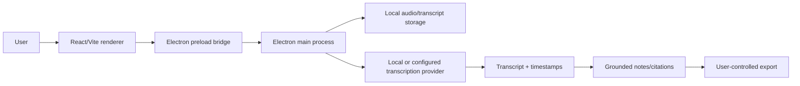

# Listenly — System Architecture and Operational Design

> **Disclosure boundary:** This document is safe for repository publication. It contains no credentials, secrets, personal records, private endpoints, raw logs, cookies, phone numbers, customer data, or proprietary prompt text. Environment variable names and route names are included only where they describe an engineering contract; values are intentionally omitted.

## 1. Product boundary

Listenly is a local-first desktop listening, transcription, and notes workflow built with Electron, Vite, and React. The repository contains renderer and Node code, scripts, context/citation tests, packaging configuration, and a Windows unpacked artifact. Its useful boundary is importing audio, transcribing through a configured provider or local model, grounding notes in the transcript, and exporting user-owned results.

Listenly is not an always-on recorder by default. Recording, microphone access, transcript retention, provider upload, and export must be visible choices. Audio files, transcripts, citations, and personal conversations are sensitive; none belong in public documentation or source control.

## 2. Topology

Electron owns filesystem and audio-process access through a narrow preload bridge. React/Vite renders import, listening, transcript, context, citation, search, and export views. The transcription/provider boundary should be explicit so local/offline and remote providers can fail independently.



The renderer must not receive unrestricted filesystem or shell access. Context results should retain citations or source spans that explain how a note was derived. A citation is evidence of grounding, not proof that the audio statement was true.

## 3. Data and consistency

The local data model includes imported audio metadata, processing state, transcript segments, citation spans, notes, search index state, provider configuration, and export history. Keep raw audio separate from derived text so users can delete one without assuming the other disappeared. Restart recovery must preserve incomplete status and allow resume or safe discard.

Large files should stream or process incrementally rather than loading the whole recording into renderer memory. Cancellation must stop provider work, close file handles, and leave a resumable or explicitly cancelled state. Offline mode should identify which provider operations remain available.

## 4. Privacy and interface contracts

The application must request microphone and file permissions only when needed and explain the reason. Remote transcription requires consent, endpoint disclosure, retention duration, and a delete path. Provider keys belong in OS-backed secure storage or a server-side configuration boundary, not renderer localStorage or committed `.env` files.

UI states need import progress, transcription progress, partial result, provider unavailable, permission denied, cancellation, empty transcript, citation unavailable, export failure, and restart recovery. Export should let users choose format and destination without automatically uploading content.

## 5. Failure modes and resilience

Expected failures include unsupported audio format, permission denied, large file, corrupted input, partial transcription, provider timeout, provider quota, network loss, model failure, cancellation during segmentation, citation mismatch, storage-capacity-exhaustion, renderer restart, and app upgrade. The application must not silently resume microphone capture after restart.

A provider adapter should expose capability and error class, not raw provider response. Retry only transient failures. A partial transcript should be clearly marked and should not be presented as complete notes. Delete must cover original audio, transcript, derived notes, caches, and export references.

## 6. Operations and evidence

The verified local gates are Electron build, Node/web typecheck, context/citation test, `npm test` through the test alias, and Windows unpacked packaging. The context test produced two citations and a grounded-context summary. Electron-builder reports that the default Electron icon is used; release branding remains a polish item.

```bash
npm ci
npm run typecheck
npm test
npm run build
npm run pack:win
```

Local diagnostics may record file size, format, processing duration, provider category, cancellation, and safe error code. Do not log audio content, transcript bodies, API keys, microphone data, or full filenames containing personal information. Any crash report must redact paths and text.

## 7. Trade-offs and release gates

Local-first storage improves privacy and offline behavior but makes backup, encryption, upgrade, and multi-device synchronization the user's responsibility. A provider abstraction allows cost and quality comparisons but creates different data-retention policies. Electron gives desktop permissions and packaging but requires careful preload isolation.

Launch requires audio import formats, permissions, cancellation, partial transcription, offline behavior, provider failure, export, search, encryption/privacy, restart recovery, clean-install packaging, and a branded icon. No recording or provider upload is part of the verified evidence.

## Evidence ledger

| Evidence | Source or command | Result |
|---|---|---|
| Application | `src`, Electron configuration | Electron/Vite/React local-first workflow. |
| Context test | `npm test` | Grounded context result with two citations. |
| Type safety | `npm run typecheck` | Node/web checks passed. |
| Packaging | `npm run pack:win` | Windows unpacked package passed. |
| Release polish | `electron-builder.yml` output | Default Electron icon remains. |

## Known gaps

Audio-format matrix, permissions, large-file behavior, cancellation, offline and provider failures, privacy/retention, restart recovery, clean install, and branded release assets remain open. No audio, transcript, or personal data is documented.
